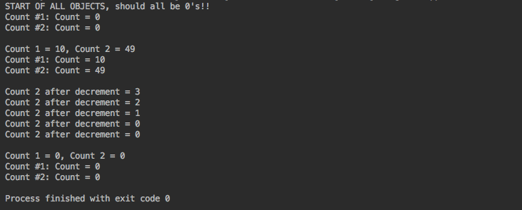

## Counter Project

Define a class called Counter that will be used to count things. An object of this class records a count that is a
nonnegative integer. The only method that can set the counter is the one that sets it to 0 (reset). Include the
following methods only:

<li>toString method</li>
<li>reset the count to 0</li>
<li>current value of count returned</li>
<li>increment the count by 1</li>
<li>decrement the count by 1, but should not allow the value of the count to become negative</li>
 
